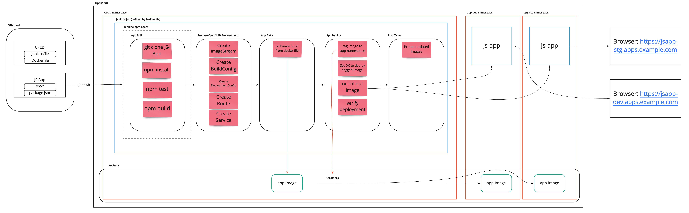
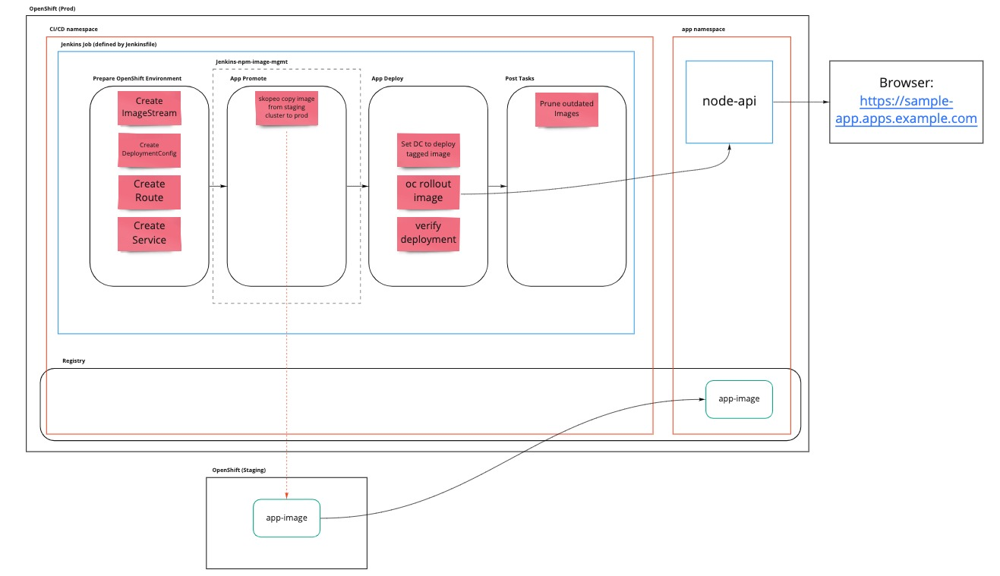
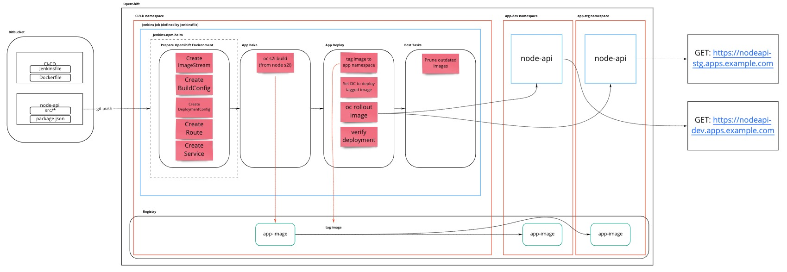

= App CI/CD processes

This README contains docs for 3 Jenkins pipelines. The first is a simple Openshift app pipeline,the second being a pipeline to promote to a production instance of Openshift and the third a pipeline to deploy NodeJS apps.

== Deploying Jenkins Agent
The Jenkinsfiles in this repo make use of Jenkins Agents for NPM, Helm, and image management (Skopeo). Install these by running:

`git clone https://github.com/redhat-cop/containers-quickstarts.git`

```
oc process -f containers-quickstarts/.openshift/templates/jenkins-agent-generic-template.yml \
    -p NAME=jenkins-agent-npm \
    -p SOURCE_CONTEXT_DIR=jenkins-agents/jenkins-agent-npm \
    | oc apply -f -
```

```
oc process -f containers-quickstarts/.openshift/templates/jenkins-agent-generic-template.yml \
    -p NAME=jenkins-agent-helm \
    -p SOURCE_CONTEXT_DIR=jenkins-agents/jenkins-agent-helm \
    | oc apply -f -
```

```
oc process -f containers-quickstarts/.openshift/templates/jenkins-agent-generic-template.yml \
    -p NAME=jenkins-agent-image-mgmt \
    -p SOURCE_CONTEXT_DIR=jenkins-agents/jenkins-agent-image-mgmt \
    | oc apply -f -
```

== App build
```
oc process -f .openshift/app_build.yaml | oc apply -f -
```

== App deploy
```
oc process -f .openshift/app_deploy.yaml | oc apply -f -
```

== Jenkinsfile 
Set up a jenkins job to take in this Jenkinsfile. It will then take in any number of applications by setting parameters. The following params are required (with a suggested default):

```ini

PIPELINES_NAMESPACE = "app-ci-cd"
PROJECT_NAMESPACE = "app-${ENVIRONMENT}"
APP_NAME = "test-app"
SOURCE_REPOSITORY_REF = "master"
SOURCE_REPOSITORY_URL = "https://github.com/Tompage1994/simple-app-project"
ENVIRONMENT = choice(dev,stg,prod)
WILDCARD_ROUTE = "apps.ocp.example.com" (Though this could be hardcoded in local scm)

```

=== The pipeline
The following table will give an overview of each stage of the pipeline. The pipeline is based off the Jenkinsfile in this repo with the app being deployed from https://github.com/Tompage1994/sample-openshift-app[sample-openshift-app]. The pipeline will build and deploy the app to Openshift.

[%header,cols=3*]
|===
|Stage Name
|Agent
|Tasks

|*Pre build*
|master
a| 1. Set environment variables
2. Set job configuration

|*App Build*
|jenkins-agent-npm
a| 1. Pulls the source repository from the specified branch
2. Downloads NPM packages and its dependencies specified in the source repository
3. Runs the build with the specified environment (eg: dev, staging, prod).
4. Stashes the `dist` directory to be used by other agents.

|*Prepare OpenShift Environment*
|master
a| 1. Build hostname variable based on app-name and environment.
2. Build the app_build manifest from template and apply it
3. Build the app_deploy manifest from template and apply it

|*App Bake*
|master
a| 1. Unstash the `dist` directory.
2. Patch the build config with the correct ImageStreamTag.
3. Build the latest image from the contents of current directory and stores the image in the Openshfit registry.

|*App Deploy*
|master
a| 1. Tag the newly built image to be used in the application namespace.
2. Sets the deployment config to use the newly built image.
3. Rolls out the latest deployment config
4. Verify the OCP deployment

|*Post build*
|master
a| 1. Prune old images

|===

The below diagram shows https://openpracticelibrary.com/practice/the-big-picture/['The Big Picture'] for the application pipeline.

.Application CI/CD Pipeline


== Jenkinsfile.prod

=== The pipeline
The following table will give an overview of each stage of the pipeline. The pipeline is based off the Jenkinsfile.prod in this repo with an image being promoted from one Openshift cluster to another. 

[%header,cols=3*]
|===
|Stage Name
|Agent
|Tasks

|*Pre build*
|master
a| 1. Set `SRC_IMAGE_SA` credentials from Jenkins secret.
2. Set job configuration

|*Prepare OpenShift Environment*
|master
a| 1. Process and deploy the `app_deploy` template with parameters set in Jenkins. `app_deploy` will create an ImageStream, Service, Route and DeploymentConfig in the destination cluster.


|*App Promote*
|jenkins-agent-image-mgmt
a| 1. Set the source cluster service account credentials into the `src_creds` variable
2. Set the destination cluster service account credentials into the `dest_creds` variable
3. Use Skopeo to copy (promote) the image from the source to destination cluster.

|*App Deploy*
|master
a| 1. Set the image to the correct deployment config
2. Rollout the latest deployment config
3. Verify the OCP Deployment 
|===

The below diagram shows https://openpracticelibrary.com/practice/the-big-picture/['The Big Picture'] for the promotion to prod pipeline.

.Promotion CI/CD Pipeline



== Jenkinsfile.nodejs

=== The pipeline
The following table will give an overview of each stage of the pipeline. The pipeline is based off the Jenkinsfile.nodejs which builds and deploys this https://github.com/Tompage1994/sample-openshift-node-api[nodejs app] on to Openshift.  

[%header,cols=3*]
|===
|Stage Name
|Agent
|Tasks

|*Pre build*
|master
a| 1. Set environment variables
2. Set job configuration

|*Prepare OpenShift Environment*
|jenkins-agent-helm
a| 1. Set `APP_NAME` with appended `ENVIRONMENT` type.
2. Build and Apply the `build` helm template with set variables in the specified namespace.
3. Build and Apply the `deployment` helm template with set variables in the specified namespace.

|*App Bake*
|master
a| 1. Patch the BuildConfig with the latest ImageStream tag
2. Start the app build

|*App Deploy*
|master
a| 1. Tag the newly built image to be used in the application namespace.
2. Sets the deployment config to use the newly built image.
3. Rolls out the latest deployment config
4. Verify the OCP deployment

|*Post build*
|master
a| 1. Prune old images

|===

The below diagram shows https://openpracticelibrary.com/practice/the-big-picture/['The Big Picture'] for the nodejs app deployment pipeline.

.NodeJS backend CI/CD Pipeline


= Helm Usage

Builds the app_build template and applies it.

```
helm template ./helm/app_build/ --set=name=simple-openshift-app | oc apply -f - 
```

Builds the app_deploy template and applies it.
```
helm template ./helm/app_deploy/ --set=name=simple-openshift-app,namespace=example,wildcard_route=apps.cluster-1fc7.1fc7.sandbox302.opentlc.com,image_repo=image-registry.openshift-image-registry.svc:5000 | oc apply -f - 
``` 

